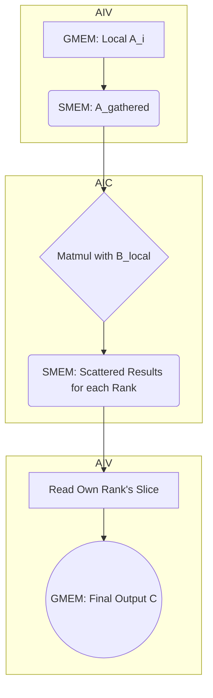

# Allgather + Matmul with Fused-Scatter 融合算子设计文档

## 1. 算子功能描述

本算子旨在将 `Allgather` 和 `Matmul` 操作融合，并在 `Matmul` 的计算过程中，**将通信操作（Scatter）融合进计算的结尾阶段（Epilogue）**，从而最大限度地减少核函数启动开销和DDR读写，优化大模型推理性能。

算子的核心思想是解决一个混合并行（数据并行+张量并行）下的矩阵乘法问题。其主要流程为：
1.  通过 `Allgather` 将所有计算设备（Rank）上不同的输入激活 `A_i` 汇集起来。
2.  每个设备上的计算核心（AIC）使用汇集后的全量激活 `A_gathered` 与其本地持有的部分权重 `B_i` 进行矩阵乘法。
3.  在矩阵乘法计算的同时，根据结果数据块的最终归属地，将其直接写入到目标设备可以访问的共享内存（Symmetric Memory）区域中。
4.  最后，每个设备上的向量核心（AIV）从共享内存中读取所有其他设备为它准备好的数据，进行转置后处理，得到最终输出。

## 2. 设计细节

### 2.1. 利用对称内存（Symmetric Memory）的通信机制

本算子的所有跨Rank通信均通过**对称内存**完成。对称内存是一块由 `shmem_malloc` 在所有Rank上分配的大小和地址均相同的特殊内存区域。任何一个Rank都可以通过SHMEM提供的通信接口（如`shmem_put`/`shmem_get`）直接读写其他Rank的对称内存，这为高效的核函数内（In-Kernel）通信提供了基础。

- **Allgather阶段**: AIV核利用对称内存作为公告板，所有Rank将自己的输入`A`写入该内存，从而实现数据汇集。
- **Matmul-Scatter阶段**: AIC核在计算出结果后，利用对称内存作为高速通道，直接将数据“投递”给目标Rank，避免了写回本地DDR再由AIV搬运的开销。

### 2.2. 数据流与Shape变换

假设 `rankSize` 是通信组中的设备数量，`M, K, N` 是逻辑上的矩阵维度。

1.  **输入 (Input)**:
    *   每个 rank `i` 拥有**独特**的输入激活张量 `A_i`，Shape: `[M, K]`。
    *   每个 rank `i` 持有**独特**的部分权重张量 `B_i`，Shape: `[K, N/rankSize]`。

2.  **阶段一: Allgather (AIV Core)**:
    *   **操作**: 所有Rank的AIV核协同，将各自的 `A_i` 写入对称内存工作区。
    *   **结果**: 在对称内存中形成一个完整的 `A_gathered` 张量，逻辑Shape: `[rankSize, M, K]`。

3.  **阶段二: Matmul with Fused Scatter (AIC Core)**:
    *   **操作**: 每个Rank `i`的AIC核从对称内存中读取完整的 `A_gathered`，并与自己的权重分片 `B_i` 相乘。
    *   **融合通信**: 对于计算出的每一个数据块，例如 `A_j @ B_i`（`A_gathered`的第`j`片与`B_i`的乘积），AIC核判断出其最终归属地应为Rank `j`。
    *   **直接写入**: AIC核通过SHMEM接口，将 `A_j @ B_i` 的计算结果直接写入对称内存中为Rank `j`预留的接收区域。
    *   **结果**: 当所有AIC核计算完成后，对称内存中Rank `j`的接收区域已经包含了来自所有其他Rank `i`计算的 `(A_j @ B_0, A_j @ B_1, ...)` 的结果。

4.  **阶段三: Final Transpose & Copy (AIV Core)**:
    *   **操作**: 每个Rank `j`的AIV核从自己的接收区域读取所有数据块，其逻辑Shape为 `[rankSize, M, N/rankSize]`，但数据内容已经是 `(A_j@B_0, A_j@B_1, ...)`。
    *   **视图变换与转置**:
        *   数据被重新解释（view）为 `[M, N]`。
        *   （根据需要）执行转置操作，得到最终的 `[M, N]` 格式。
    *   **写回**: 将最终结果从工作区拷贝回全局内存（Global Memory）的输出指针 `C`。

5.  **最终输出 (Final Output)**:
    *   每个 rank `j` 得到完整的最终结果矩阵的一部分，Shape: `[M, N]`。

### 2.3. Host侧接口设计

```cpp
void allgather_matmul_alltoall(
    const half* A,         // 输入矩阵A, shape [M, K]
    const half* B,         // 输入矩阵B, shape [K, N/rank_size]
    half* C,               // 输出矩阵C, shape [M, N]
    int M,
    int K,
    int N,
    int rank,
    int rank_size,
    aclrtStream stream
);
```

## 2.4. 计算通信协作流程 (Mermaid)


# 3. 验证方案
Host侧验证:
数据生成:
在每个 rank i 上，生成其独特的输入激活 A_i (shape [M, K]) 和权重 B_i (shape [K, N/rankSize])。
Golden结果计算 (精确模拟):
为了正确验证，需要在Host侧精确模拟算子的计算流，而不是进行简单的拼接后矩阵乘法。
模拟Allgather: A_gathered = stack(A_0, A_1, ...)。
模拟Batched Matmul: 对于每个Rank i，计算 C_partial_i = A_gathered @ B_i。
模拟Alltoall/Scatter: 重新组织 C_partial 结果。对于每个目标Rank j，收集所有 C_partial_i 中的第 j 片，即 (C_partial_0[j], C_partial_1[j], ...)。
模拟Final Transpose: 对收集到的数据进行最终的转置和塑形，得到每个Rank j的最终Golden结果 C_golden_j。
执行算子:
所有 rank 调用融合算子核函数，得到各自的输出 C_npu_i。
结果校验:
在每个 rank i 上，比较其算子输出 C_npu_i 和对应的 C_golden_i，确保误差在允许范围内。