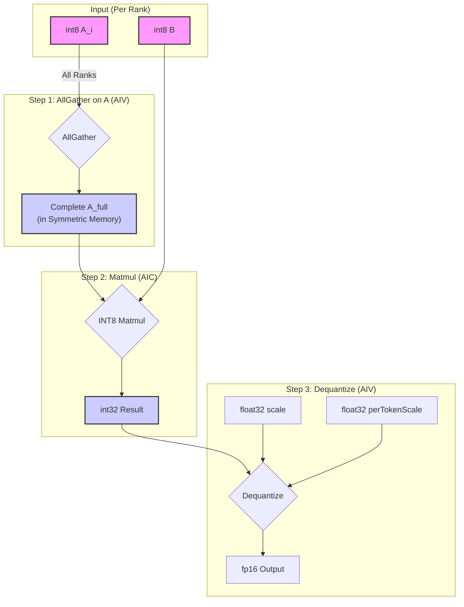
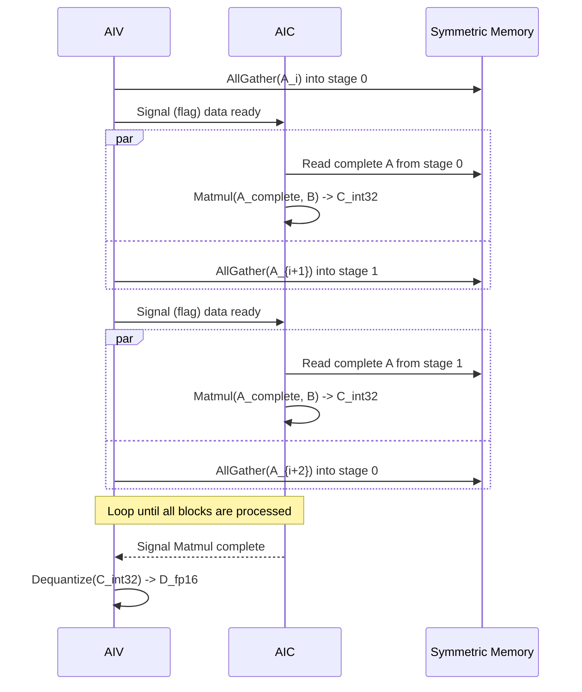

# AllGather矩阵乘法反量化算子设计文档

## 1. 算子概述

### 1.1 功能描述
AllGather矩阵乘法反量化算子（AllGatherDequantMatmul）是一个支持INT8量化的分布式矩阵乘法算子，结合AllGather通信模式，用于高效的大规模分布式深度学习训练。

**基本流程如下：**
1.  **通信 (AIV):** 首先，通过AllGather操作将各个计算单元（Rank）的INT8输入矩阵`A`在后台(AIV)进行收集。数据被写入一个共享内存工作区（Symmetric Workspace）。
2.  **计算 (AIC):** 计算核心(AIC)等待AllGather操作准备好数据后，从共享内存工作区中读取完整的、拼接后的大矩阵`A`，并与本地的INT8矩阵`B`执行一次大规模的矩阵乘法，得到`INT32`的中间结果`C`。即 `C_int32 = AllGathered_A_int8 x B_int8`。
3.  **后处理 (AIV):** 最后，AIV核心对`INT32`的中间结果`C`执行反量化操作，并转换为最终的`FP16`输出。

该算子通过将通信（AllGather）和计算（Matmul）流水线化，以及在低精度（INT8）数据上进行通信，实现了高效的分布式计算。

### 1.2 算子签名
```cpp
void AllGatherDequantMatmul(
    uint64_t fftsAddr,
    GM_ADDR aDevice,           // 输入矩阵A: [M, K], int8
    GM_ADDR bDevice,           // 输入矩阵B: [K, N], int8  
    GM_ADDR cDevice,           // 中间结果矩阵: [M*rankSize, N], int32
    GM_ADDR symmetricPtr,      // 用于Rank间通信的共享内存工作空间 (workspace)
    GM_ADDR dDevice,           // 输出矩阵: [M*rankSize, N], fp16
    GM_ADDR deviceScale,       // per-channel 量化缩放因子: [N], float32
    GM_ADDR devicePerTokenScale, // per-token 量化缩放因子: [M], float32
    uint32_t m, 
    uint32_t n, 
    uint32_t k
);
```

### 1.3 输入输出规格
| 参数 | 形状 | 数据类型 | 描述 |
|------|------|----------|------|
| aDevice | [M, K] | int8 | 量化后的输入矩阵A |
| bDevice | [K, N] | int8 | 量化后的输入矩阵B |
| cDevice | [M*rankSize, N] | int32 | Matmul的int32输出 / Dequantize的输入 |
| dDevice | [M*rankSize, N] | fp16 | 最终输出矩阵 |
| deviceScale | [N] | float32 | B矩阵的per-channel量化缩放因子 |
| devicePerTokenScale | [M] | float32 | A矩阵的per-token量化缩放因子 |
| symmetricPtr | - | GM_ADDR | AllGather通信的工作空间，用于存储完整的A矩阵 |

## 2. 量化算法设计

### 2.1 核心计算流程


### 2.2 量化与反量化公式
```c++
    // 伪代码: 量化 (Host侧准备)
    a_int8_per_rank = round(a_fp32_per_rank / perTokenScale)
    b_int8 = round(b_fp32 / scale)

    // --- Kernel ---
    // 伪代码：1. AllGather (on AIV)
    // 将各Rank的 a_int8_per_rank 收集到 symmetric_workspace
    complete_a_int8 = allgather(a_int8_per_rank) across all ranks

    // 伪代码: 2. 矩阵乘法 (on AIC)
    // 使用收集到的完整A矩阵与本地B矩阵进行计算
    result_int32 = matmul(complete_a_int8, b_int8)

    // 伪代码: 3. 反量化 (on AIV)
    // 注意：scale的维度是[N], perTokenScale的维度是[M*rankSize]
    result_fp32 = result_int32 * perTokenScale_all_ranks * scale
    output_fp16 = cast_to_fp16(result_fp32)
```

## 3. 核心实现架构

### 3.1 计算与通信分离
算子采用计算（AIC）和通信/后处理（AIV）分离的设计，实现了任务的流水线执行。
- **AIV (AI Vector Core)**: 负责两个阶段：
  1. **通信:** 执行 `AllGather` 操作，将所有Rank的 `INT8` 矩阵A收集到共享工作区。
  2. **后处理:** 在AIC计算完成后，对 `INT32` 结果执行反量化操作，得到最终的 `FP16` 输出。
- **AIC (AI Core)**: 负责核心的计算任务，即执行高密度的 `INT8 × INT8 → INT32` 矩阵乘法。它从共享工作区读取由AIV准备好的完整矩阵A进行计算。

### 3.2 主要模块
- **BlockMmad**: `catlass`库提供的矩阵乘法模块，通过`MmadAtlasA2Pingpong`调度策略，执行分块的INT8矩阵乘法。
- **CommBlockEpilogue**: `catcoc`库提供的通信Epilogue，用于执行 `AllGather` 操作。它将所有Rank的INT8矩阵A收集到每个Rank。
- **BlockEpilogueDequant**: `catlass`库提供的后处理Epilogue，用于在 `AllGather` 完成后，对INT32结果进行反量化，并转换为 `FP16`。

## 4. 内存布局设计

### 4.1 全局内存 (Global Memory)
- **输入布局**: `aDevice`, `bDevice`, `deviceScale`, `devicePerTokenScale` 均存储在GM中。
- **中间结果布局**: 每个Rank计算出的 `INT32` 累加器结果存储在各自的GM空间中，形状为 `[M*rankSize, N]`。
- **输出布局**: 最终的 `FP16` 输出也存储在GM中，形状为 `[M*rankSize, N]`。

### 4.2 共享内存 (Symmetric Memory)
- **用途**: `symmetricPtr` 指向的共享内存区域被用作 `AllGather` 操作的**临时工作空间（Workspace）**。
- **工作方式**: 在 `AllGather` 过程中，每个Rank需要将自己的INT8矩阵A写入到共享内存区域，然后所有Rank从这个区域读取完整的矩阵A。
- **布局**:
  ```cpp
  Catlass::layout::RowMajor layoutSymmetric{
      WORKSPACE_STAGES * rankSize * commSizeM,
      K,
      K
  };
  ```

## 5. 通信模式适配

### 5.1 AIV/AIC流水线工作模式
算子的核心是AIV和AIC之间的流水线（Pipeline）作业。
1.  **AIV (通信先行):** AIV核首先启动，执行 `AllGather` 操作，将第一个数据块从所有Rank收集到共享工作区（Symmetric Workspace）的stage 0缓冲区。
2.  **AIV通知AIC:** 当stage 0的数据准备好后，AIV通过flag机制通知AIC可以开始计算。同时，AIV开始将第二个数据块收集到stage 1缓冲区。
3.  **AIC (计算):** AIC核被唤醒，从共享工作区的stage 0缓冲区读取完整的矩阵`A`数据块，并与本地矩阵`B`进行矩阵乘法。
4.  **循环执行:** AIC在计算stage 0时，AIV在准备stage 1的数据。当AIC完成stage 0的计算后，它会等待AIV准备好stage 1的数据。这个过程循环往复，实现了通信和计算的高度重叠。
5.  **AIV (最终处理):** 在所有计算完成后，AIV负责对AIC产生的`INT32`结果进行最后的回写和反量化。

### 5.2 流程图


## 6. 工作空间管理

### 6.1 多阶段流水线
算子使用 `WORKSPACE_STAGES = 2` 的多阶段流水线设计，通过 `commInterval = 3` 控制通信间隔，实现计算与通信的重叠。

### 6.2 内存复用策略
- **共享内存复用**: 使用共享内存作为AllGather操作的临时缓冲区，避免重复分配。
- **流水线缓冲**: 通过多阶段设计，实现计算与通信的并行执行。

## 7. 总结

该量化算子通过将高成本的通信操作（AllGather）在 `INT8` 数据上完成，避免了在 `FP16` 或 `FP32` 上进行通信，从而优化了性能。同时，通过精确的量化参数处理，确保了在多Rank环境下的计算精度。共享内存（Symmetric Memory）在此过程中扮演了关键的临时数据交换区的角色。

## 8. 使用指南

### 8.1 编译

```bash
cd examples/allgather_matmul_dequant/scripts
bash build.sh
```

### 8.2 运行

```bash
# 在2个设备上运行（设备0和1）
bash run.sh 0,1

# 在4个设备上运行（设备1, 3, 5, 7）
bash run.sh 1,3,5,7
```

### 8.3 测试形状

测试形状定义在 `scripts/test_shapes.csv` 中：
```
M,K,N
16384,27392,4096
131072,8192,3072
64,16384,7168
```

### 8.4 数据文件

在 `output/` 目录中生成以下数据文件：
- `x1_gm.bin`: 量化输入矩阵A (int8)
- `x2_gm.bin`: 量化输入矩阵B (int8)
- `c_gm.bin`: 中间累加结果矩阵 (int32)
- `d_gm.bin`: 输出矩阵 (fp16)
- `scale_x1_gm.bin`: 矩阵A的per-token量化缩放因子 (float32)
- `scale_x2_gm.bin`: 矩阵B的per-channel量化缩放因子 (float32)
- `golden.bin`: 验证用的期望输出 (fp16)
- `output.bin`: 算子的实际输出 (fp16)

### 8.5 验证

脚本会自动验证输出结果与黄金参考的差异，使用现有的 `verify_result.py` 进行精度验证。该验证脚本支持 fp16 数据类型的精度检查。

#### 8.5.1 校验逻辑说明 (Note on Verification Logic)
当前的验证方案使用了一种**弱校验逻辑**。

当前的测试脚本 (`run.sh` 和 `gen_data.py`) 通过在每个Rank上加载**完全相同**的输入矩阵 `A` (`a_gm.bin`) 来进行测试。在这种 `A0=A1=...` 的特殊情况下，根据分块矩阵乘法原理 `[[A0],[A1]]@B = [[A0@B],[A1@B]]`，`Matmul(AllGather(A), B)` 的计算结果恰好等同于 `Concat(Matmul(A0, B))`。因此，当前基于`gen_data.py`生成的`golden.bin`的校验能够通过。

然而，此算子的设计目标是支持各Rank上`A_i`**不相同**的通用场景。当前的校验逻辑并未覆盖这种通用场景。

**如需实现严格校验**，需要修改数据生成和加载流程：
1.  修改 `gen_data.py`，使其能为每个Rank `i` 生成唯一的输入文件 `a_gm_rank_{i}.bin`。
2.  主程序需要能够根据当前`rankId`加载对应的 `a_gm_rank_{i}.bin`。
3.  生成`golden.bin`的逻辑需要修改为：将所有`a_gm_rank_{i}.bin`的数据拼接成一个完整的`A`矩阵，再与`B`矩阵相乘并反量化，以产生与算子行为完全一致的期望结果。

### 8.6 调试模式

设置环境变量启用调试模式：
```bash
export debug=1
bash run.sh 0,1
```

调试模式下会使用全1矩阵和固定缩放因子，便于问题排查。

### 8.7 环境要求

- Ascend Toolkit 已正确安装
- SHMEM 环境已配置
- PyTorch 支持（用于数据生成和验证）
- 支持 fp16 数据类型的硬件环境

## 9. 与Reduce-Scatter算子的对比

| 特性 | AllGather算子 | Reduce-Scatter算子 |
|------|---------------|-------------------|
| 通信模式 | AllGather | Reduce-Scatter |
| 通信数据类型 | INT8 | INT32 |
| 输出形状 | [M*rankSize, N] | [M/rankSize, N] |
| 偏置支持 | 否 | 是 |
| 适用场景 | 需要完整矩阵A的场景 | 需要分片结果的场景 |
| 内存占用 | 较高（需要完整矩阵） | 较低（分片存储） |
