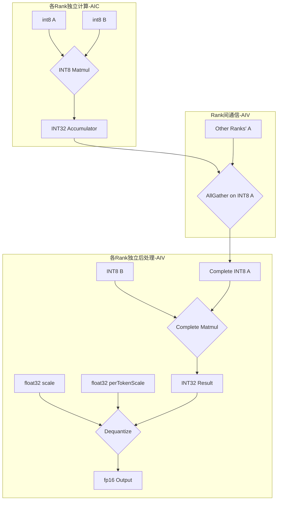

# AllGather矩阵乘法反量化算子设计文档

## 1. 算子概述

### 1.1 功能描述
AllGather矩阵乘法反量化算子（AllGatherDequantMatmul）是一个支持INT8量化的分布式矩阵乘法算子，结合AllGather通信模式，用于高效的大规模分布式深度学习训练。

它首先在每个计算单元（Rank）上独立执行INT8矩阵乘法，得到`INT32_ACC = INT8_A x INT8_B`的累加结果。随后，通过AllGather操作将所有Rank的INT8输入矩阵A进行收集，每个Rank获得完整的矩阵A。然后，每个Rank使用完整的矩阵A与本地矩阵B进行矩阵乘法，得到INT32中间结果。最后，每个Rank对INT32结果执行反量化，得到最终的FP16输出。

### 1.2 算子签名
```cpp
void AllGatherDequantMatmul(
    uint64_t fftsAddr,
    GM_ADDR aDevice,           // 输入矩阵A: [M, K], int8
    GM_ADDR bDevice,           // 输入矩阵B: [K, N], int8  
    GM_ADDR cDevice,           // 中间结果矩阵: [M*rankSize, N], int32
    GM_ADDR symmetricPtr,      // 用于Rank间通信的共享内存工作空间 (workspace)
    GM_ADDR dDevice,           // 输出矩阵: [M*rankSize, N], fp16
    GM_ADDR deviceScale,       // per-channel 量化缩放因子: [N], float32
    GM_ADDR devicePerTokenScale, // per-token 量化缩放因子: [M], float32
    uint32_t m, 
    uint32_t n, 
    uint32_t k
);
```

### 1.3 输入输出规格
| 参数 | 形状 | 数据类型 | 描述 |
|------|------|----------|------|
| aDevice | [M, K] | int8 | 量化后的输入矩阵A |
| bDevice | [K, N] | int8 | 量化后的输入矩阵B |
| cDevice | [M*rankSize, N] | int32 | 中间累加结果矩阵 |
| dDevice | [M*rankSize, N] | fp16 | 输出矩阵 |
| deviceScale | [N] | float32 | B矩阵的per-channel量化缩放因子 |
| devicePerTokenScale | [M] | float32 | A矩阵的per-token量化缩放因子 |
| symmetricPtr | - | GM_ADDR | 用于AllGather通信的共享内存工作区 |

## 2. 量化算法设计

### 2.1 核心计算流程


### 2.2 量化与反量化公式
```c++
    // 伪代码: 量化
    a_int8 = round(a_fp32 / perTokenScale)
    b_int8 = round(b_fp32 / scale)

    // 伪代码: INT8矩阵乘法（Per-Rank，on AIC）
    accumulator_int32_per_rank = matmul(a_int8, b_int8)

    // 伪代码：AllGather（on AIV)
    complete_a_int8 = allgather(a_int8) across all ranks

    // 伪代码: 完整矩阵乘法
    complete_result_int32 = matmul(complete_a_int8, b_int8)

    // 伪代码: 反量化
    result_fp32 = complete_result_int32 * perTokenScale * scale
    output_fp16 = cast_to_fp16(result_fp32)
```

## 3. 核心实现架构

### 3.1 计算与通信分离
算子采用计算（AIC）和通信/后处理（AIV）分离的设计。
- **AIC (AI Core)**: 负责执行高密度的 `INT8 × INT8 → INT32` 矩阵乘法计算。
- **AIV (AI Vector Core)**: 负责执行 `AllGather` 通信，以及后续的完整矩阵乘法和反量化等处理。

### 3.2 主要模块
- **BlockMmad**: `catlass`库提供的矩阵乘法模块，通过`MmadAtlasA2Pingpong`调度策略，执行分块的INT8矩阵乘法。
- **CommBlockEpilogue**: `catcoc`库提供的通信Epilogue，用于执行 `AllGather` 操作。它将所有Rank的INT8矩阵A收集到每个Rank。
- **BlockEpilogueDequant**: `catlass`库提供的后处理Epilogue，用于在 `AllGather` 完成后，对INT32结果进行反量化，并转换为 `FP16`。

## 4. 内存布局设计

### 4.1 全局内存 (Global Memory)
- **输入布局**: `aDevice`, `bDevice`, `deviceScale`, `devicePerTokenScale` 均存储在GM中。
- **中间结果布局**: 每个Rank计算出的 `INT32` 累加器结果存储在各自的GM空间中，形状为 `[M*rankSize, N]`。
- **输出布局**: 最终的 `FP16` 输出也存储在GM中，形状为 `[M*rankSize, N]`。

### 4.2 共享内存 (Symmetric Memory)
- **用途**: `symmetricPtr` 指向的共享内存区域被用作 `AllGather` 操作的**临时工作空间（Workspace）**。
- **工作方式**: 在 `AllGather` 过程中，每个Rank需要将自己的INT8矩阵A写入到共享内存区域，然后所有Rank从这个区域读取完整的矩阵A。
- **布局**:
  ```cpp
  Catlass::layout::RowMajor layoutSymmetric{
      WORKSPACE_STAGES * rankSize * commSizeM,
      K,
      K
  };
  ```

## 5. 通信模式适配

### 5.1 两阶段计算与通信
算子的核心流程分为两个主要阶段：

1.  **阶段一：本地INT8矩阵乘法 (AIC)**
    - 每个Rank独立地计算其负责的 `A` 矩阵分片 (`A_i`) 与完整的 `B` 矩阵的乘积，得到 `INT32` 的中间结果。

2.  **阶段二：INT8 AllGather + 完整矩阵乘法 + 反量化 (AIV)**
    - **通信**：所有Rank通过共享内存，对 `INT8` 矩阵A执行 `AllGather` 操作。操作完成后，每个Rank会得到完整的矩阵A。
    - **计算**：每个Rank使用完整的矩阵A与本地矩阵B进行矩阵乘法，得到INT32结果。
    - **后处理**：每个Rank独立地对其持有的 `INT32` 结果执行反量化操作，最终得到 `FP16` 格式的输出。

### 5.2 流程图
```mermaid
graph TD
    participant Rank0 as Rank 0
    participant Rank1 as Rank 1
    
    Note over Rank0,Rank1: 阶段1：本地INT8计算 (AIC)
    Rank0->>Rank0: Matmul: C0_int32 = A0_int8 × B_int8
    Rank1->>Rank1: Matmul: C1_int32 = A1_int8 × B_int8
    
    Note over Rank0,Rank1: 阶段2：INT8 AllGather (AIV)
    Rank0-->>Rank1: 交换A0, A1的INT8数据
    Rank1-->>Rank0: (通过共享内存)
    
    Note over Rank0,Rank1: 阶段3：完整矩阵乘法 (AIV)
    Rank0->>Rank0: Complete Matmul: A0+A1 × B -> Result0_int32
    Rank1->>Rank1: Complete Matmul: A0+A1 × B -> Result1_int32
    
    Note over Rank0,Rank1: 阶段4：反量化 (AIV)
    Rank0->>Rank0: Dequantize(Result0_int32) -> Output0_fp16
    Rank1->>Rank1: Dequantize(Result1_int32) -> Output1_fp16
```

## 6. 工作空间管理

### 6.1 多阶段流水线
算子使用 `WORKSPACE_STAGES = 2` 的多阶段流水线设计，通过 `commInterval = 3` 控制通信间隔，实现计算与通信的重叠。

### 6.2 内存复用策略
- **共享内存复用**: 使用共享内存作为AllGather操作的临时缓冲区，避免重复分配。
- **流水线缓冲**: 通过多阶段设计，实现计算与通信的并行执行。

## 7. 总结

该量化算子通过将高成本的通信操作（AllGather）在 `INT8` 数据上完成，避免了在 `FP16` 或 `FP32` 上进行通信，从而优化了性能。同时，通过精确的量化参数处理，确保了在多Rank环境下的计算精度。共享内存（Symmetric Memory）在此过程中扮演了关键的临时数据交换区的角色。

## 8. 使用指南

### 8.1 编译

```bash
cd examples/allgather_matmul_dequant/scripts
bash build.sh
```

### 8.2 运行

```bash
# 在2个设备上运行（设备0和1）
bash run.sh 0,1

# 在4个设备上运行（设备1, 3, 5, 7）
bash run.sh 1,3,5,7
```

### 8.3 测试形状

测试形状定义在 `scripts/test_shapes.csv` 中：
```
M,K,N
16384,27392,4096
131072,8192,3072
64,16384,7168
```

### 8.4 数据文件

在 `output/` 目录中生成以下数据文件：
- `x1_gm.bin`: 量化输入矩阵A (int8)
- `x2_gm.bin`: 量化输入矩阵B (int8)
- `c_gm.bin`: 中间累加结果矩阵 (int32)
- `d_gm.bin`: 输出矩阵 (fp16)
- `scale_x1_gm.bin`: 矩阵A的per-token量化缩放因子 (float32)
- `scale_x2_gm.bin`: 矩阵B的per-channel量化缩放因子 (float32)
- `golden.bin`: 验证用的期望输出 (fp16)
- `output.bin`: 算子的实际输出 (fp16)

### 8.5 验证

脚本会自动验证输出结果与黄金参考的差异，使用现有的 `verify_result.py` 进行精度验证。该验证脚本支持 fp16 数据类型的精度检查。

### 8.6 调试模式

设置环境变量启用调试模式：
```bash
export debug=1
bash run.sh 0,1
```

调试模式下会使用全1矩阵和固定缩放因子，便于问题排查。

### 8.7 环境要求

- Ascend Toolkit 已正确安装
- SHMEM 环境已配置
- PyTorch 支持（用于数据生成和验证）
- 支持 fp16 数据类型的硬件环境

## 9. 与Reduce-Scatter算子的对比

| 特性 | AllGather算子 | Reduce-Scatter算子 |
|------|---------------|-------------------|
| 通信模式 | AllGather | Reduce-Scatter |
| 通信数据类型 | INT8 | INT32 |
| 输出形状 | [M*rankSize, N] | [M/rankSize, N] |
| 偏置支持 | 否 | 是 |
| 适用场景 | 需要完整矩阵A的场景 | 需要分片结果的场景 |
| 内存占用 | 较高（需要完整矩阵） | 较低（分片存储） |
