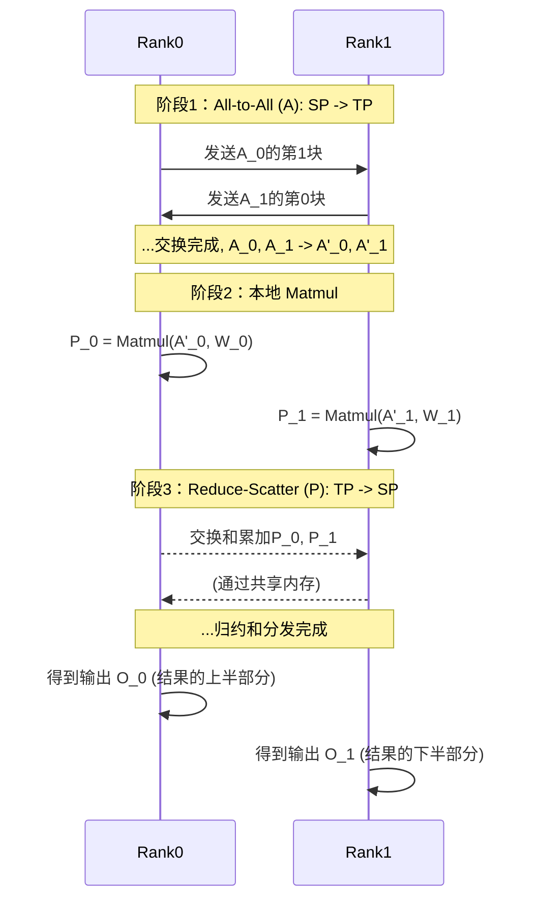

# All-to-All-Matmul-Reduce-Scatter 融合算子设计文档

## 1. 算子概述

### 1.1 功能描述
`AlltoallMatmulReduceScatter` 是一个为大规模分布式训练设计的、高度优化的融合算子，专门用于处理不同并行策略之间的转换。它将 `All-to-All` 通信、`Matmul` 矩阵乘法和 `Reduce-Scatter` 通信三个基本操作融合在单个核函数中。

该算子主要用于在序列并行（Sequence Parallelism）和张量并行（Tensor Parallelism）之间进行切换的场景，常见于大语言模型的训练中。其核心流程是：
1.  **输入**：接收一个按**序列维度**切分的激活张量和一个按**特征维度**切分的权重张量。
2.  **All-to-All**: 通过 `All-to-All` 通信，将激活张量的切分方式从“序列并行”转换为“张量并行”。
3.  **Matmul**: 执行本地矩阵乘法，得到与输入权重并行方式一致的部分和（Partial Sum）。
4.  **Reduce-Scatter**: 通过 `Reduce-Scatter` 对所有计算单元（Rank）的部分和进行求和，并将最终结果的切分方式转换回“序列并行”。

这种融合设计能在一个核函数内完成并行策略的转换和计算，显著减少了通信开销和Kernel启动延迟。

### 1.2 算子签名
```cpp
void AlltoallMatmulReduceScatter(
    uint64_t fftsAddr,
    GM_ADDR input,        // 输入矩阵 A: [M/rankSize, K], fp16
    GM_ADDR weight,       // 输入矩阵 B (权重): [K/rankSize, N], fp16
    GM_ADDR output,       // 输出矩阵: [M/rankSize, N], fp16
    GM_ADDR symmetricPtr, // 用于通信的共享内存工作空间 (workspace)
    uint32_t m,
    uint32_t n,
    uint32_t k,
    uint32_t rankSize
);
```

### 1.3 输入输出规格
| 参数 | 形状 (每个Rank) | 数据类型 | 描述 |
|--------------|---------------------|----------|--------------------------------------------------|
| input        | `[M/rankSize, K]`   | fp16     | 输入激活张量，按 **序列（M维度）** 切分 (Sequence Parallelism)。 |
| weight       | `[K/rankSize, N]`   | fp16     | 权重张量，按 **特征（K维度）** 行切分 (Tensor Parallelism)。 |
| output       | `[M/rankSize, N]`   | fp16     | 输出张量，是全局结果按 **序列（M维度）** 切分后的分片。 |
| symmetricPtr | -                   | GM_ADDR  | 用于 `All-to-All` 和 `Reduce-Scatter` 通信的共享内存工作区。 |
| m            | -                   | uint32_t | 全局输入矩阵的行数。 |
| n            | -                   | uint32_t | 全局输出矩阵的列数。 |
| k            | -                   | uint32_t | 全局输入矩阵的列数（或权重矩阵的行数）。 |
| rankSize     | -                   | uint32_t | 通信域中的设备数量。 |

## 2. 核心算法设计

### 2.1 核心计算流程
```mermaid
graph TD
    subgraph "Rank i"
        A[输入 A_i<br>[M/rankSize, K]<br>序列切分] --> B{All-to-All};
        B --> C[中间 A'_i<br>[M, K/rankSize]<br>张量切分];
        W[权重 W_i<br>[K/rankSize, N]<br>张量切分] --> D{Matmul};
        C --> D;
        D --> E[部分和 P_i<br>[M, N]];
        E --> F{Reduce-Scatter};
        G[其他Rank的部分和] --> F;
        F --> H[输出 O_i<br>[M/rankSize, N]<br>序列切分];
    end
```

### 2.2 伪代码
```cpp
// 假设有 rankSize 个计算设备 (Ranks)
// 全局矩阵: A_global [M, K], W_global [K, N]

// 1. 初始化 (Host侧)
// 每个 Rank i 持有输入和权重的分片
A_i = A_global.slice_row(i, rankSize)    // shape: [M/rankSize, K]
W_i = W_global.slice_row(i, rankSize, dim=K) // shape: [K/rankSize, N]

// 2. All-to-All (Device侧, AIV)
// 将 A 从序列并行切分转换为张量并行切分
// 每个Rank i 将自己的 [M/rankSize, K] 输入在 K 维度切成 rankSize 块
// 然后将第 j 块发送给 Rank j
// 接收后，在 M 维度拼接
A_prime_i = all_to_all(A_i, split_dim=K, concat_dim=M) // shape: [M, K/rankSize]

// 3. Matmul (Device侧, AIC)
// 执行本地矩阵乘法
P_i = matmul(A_prime_i, W_i) // shape: [M, N]

// 4. Reduce-Scatter (Device侧, AIV)
// 对所有 Rank 的部分和 P_i 求和，并将结果从张量并行切分转回序列并行切分
// P_i 在所有rank上求和后，在 M 维度上切分
O_i = reduce_scatter(P_i, reduce_op=SUM, split_dim=M) // shape: [M/rankSize, N]

// 最终，所有 Rank 的 O_i 按行拼接后，应等于 A_global @ W_global
```

## 3. 核心实现架构

### 3.1 计算与通信分离
算子遵循计算（AIC）和通信（AIV）分离的原则，以实现最大程度的并行和流水线。
- **AIV (AI Vector Core)**: 负责执行 `All-to-All` 和 `Reduce-Scatter` 两个通信操作。AIV 也负责数据的搬运和格式转换。
- **AIC (AI Core)**: 负责执行高密度的 `FP16` 矩阵乘法计算。

### 3.2 主要模块
- **CommBlockEpilogue (All-to-All)**: `catcoc` 库提供的通信模块，用于实现第一阶段的 `All-to-All` 通信。
- **BlockMmad**: `catlass` 库提供的矩阵乘法模块，执行分块的 `FP16` 矩阵乘法。
- **CommBlockEpilogue (Reduce-Scatter)**: `catcoc` 库提供的通信模块，用于实现第三阶段的 `Reduce-Scatter` 通信。

## 4. 内存布局设计

### 4.1 全局内存 (Global Memory)
- **输入布局**: `input` 和 `weight` 均按行主序（RowMajor）存储在 GM 中。
- **中间结果布局**: `All-to-All` 之后重排布的 `A_prime_i` 和 Matmul 后的部分和 `P_i` 可以视实现选择存储在 GM 或 L1/Shared Memory 中，以优化性能。
- **输出布局**: 最终的 `output` 按行主序存储在 GM 中。

### 4.2 共享内存 (Symmetric Memory)
- **用途**: `symmetricPtr` 指向的共享内存区域被用作 `All-to-All` 和 `Reduce-Scatter` 两个通信阶段的**临时工作空间（Workspace）**。
- **工作方式**:
    - 在 `All-to-All` 阶段，每个 Rank 将其 `input` 数据分块后写入 `symmetricPtr` 的指定位置，并从 `symmetricPtr` 的其他位置读取数据，重组成 `A_prime_i`。
    - 在 `Reduce-Scatter` 阶段，每个 Rank 将其部分和 `P_i` 写入 `symmetricPtr`，AIV 核心会读取其他 Rank 的数据进行累加，并将最终结果写回 `output`。
- **内存管理**: 两个通信操作可以复用同一块共享内存区域，但需要通过阶段控制或偏移量管理来避免冲突。

## 5. 通信模式详解

### 5.1 并行策略转换
算子在一个核函数内实现了从 **序列并行(SP)** 到 **张量并行(TP)** 再回到 **序列并行(SP)** 的转换。

1.  **阶段一：SP -> TP (All-to-All)**
    - **目的**: 将按序列维度切分的输入 `A` 转换为按特征维度切分，以匹配权重 `W` 的切分方式。
    - **输入**: 每个Rank `i` 持有 `A_i`，形状为 `[M/rankSize, K]`。
    - **流程**: 每个 Rank 将自己的 `[M/rankSize, K]` 输入矩阵在 `K` 维度上逻辑地切分为 `rankSize` 个小块，每块形状为 `[M/rankSize, K/rankSize]`。然后，Rank `i` 将其第 `j` 个小块发送给 Rank `j`。通信完成后，每个 Rank `j` 会收集来自所有 Rank `i` 的第 `j` 块数据，并沿 `M` 维度将它们拼接起来。
    - **输出**: 转换后的 `A'_j` 形状为 `[M, K/rankSize]`，现在它与权重 `W_j` 都是按张量并行方式切分。

2.  **阶段二：计算 (Matmul)**
    - 在每个Rank上执行本地计算 `P_j = matmul(A'_j, W_j)`，得到部分和 `P_j`，形状为 `[M, N]`。

3.  **阶段三：TP -> SP (Reduce-Scatter)**
    - **目的**: 将所有 Rank 上的部分和 `P_j` 累加，并将结果的切分方式从张量并行转回序列并行。
    - **输入**: 每个Rank `j` 持有部分和 `P_j`，形状为 `[M, N]`。
    - **流程**: 所有 Rank 对 `[M, N]` 的部分和矩阵 `P_j` 执行 `Reduce-Scatter`。该操作首先将所有Rank的 `P_j` 进行求和得到全局结果 `P_global`，然后将 `P_global` 按 `M` 维度切分，并将第 `j` 个分片发给Rank `j`。
    - **输出**: 每个Rank `j` 最终收到的 `Output_j` 形状为 `[M/rankSize, N]`，回到了序列并行切分。

### 5.2 流程图


## 6. 总结
`AlltoallMatmulReduceScatter` 算子通过在一个核函数内融合两次通信和一次计算，高效地实现了并行计算策略的转换。它避免了多次的核函数启动和数据在主机与设备间的往返，是提升大模型训练吞吐量、优化流水线效率的关键技术。
