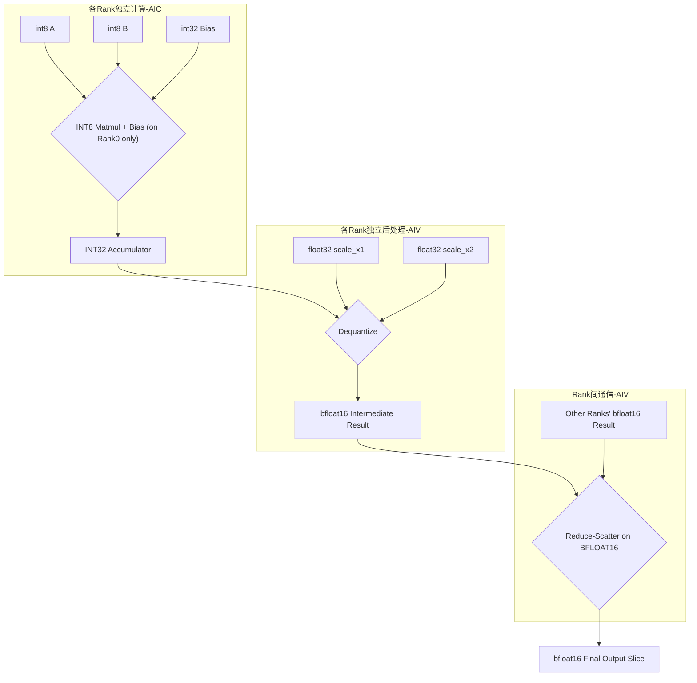
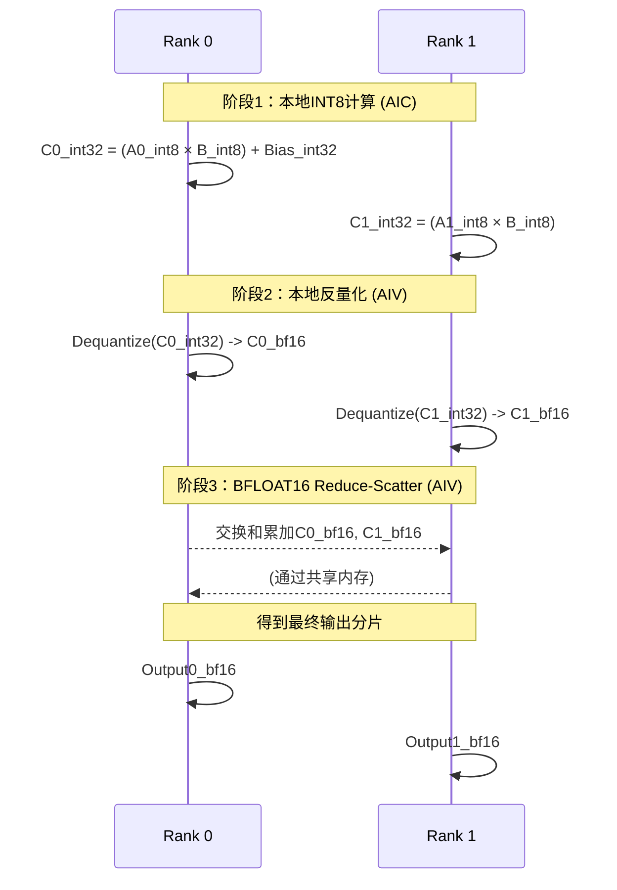

基于“**先反量化，后Reduce-Scatter**”（方案B）的思路，并结合“只有Rank0加Bias”的原则， 更新设计。 该设计的核心目标是**将通信数据量减半**。

---

# 量化矩阵乘法Reduce-Scatter算子设计文档 (通信优化版)

## 1. 算子概述

### 1.1 功能描述
本版本的量化矩阵乘法Reduce-Scatter算子 (QuantizedMatmulReduceScatter) 是一个为**通信瓶颈场景**设计的、支持INT8量化的分布式矩阵乘法算子。

它首先在每个计算单元（Rank）上独立执行INT8矩阵乘法，并在计算过程中**仅在Rank0上融合偏置加法**，得到`INT32`的累加结果。随后，每个Rank**立即**对其本地的`INT32`累加结果执行反量化，将其转换为`BFLOAT16`类型的中间结果。最后，通过Reduce-Scatter操作对所有Rank的`BFLOAT16`中间结果进行求和，并将最终分片回传给各个Rank。

**核心优化点**：通过在`BFLOAT16`（2字节）上而非`INT32`（4字节）上执行Reduce-Scatter通信，**本算子将跨Rank的通信数据量减半**，旨在显著提升通信受限场景下的端到端性能。

**注意**：此设计通过“仅Rank0加偏置”的方式，保证了最终结果在**理想代数**层面上的正确性。但由于提前将高精度的`INT32`累加器转换为低精度的`BFLOAT16`，可能会引入额外的数值误差。

### 1.2 算子签名
```cpp
// 算子签名保持不变
void QuantizedMatmulReduceScatter_CommOpt(
    uint64_t fftsAddr,
    GM_ADDR x1,           // 输入矩阵A: [M, K], int8
    GM_ADDR x2,           // 输入矩阵B: [K, N], int8  
    GM_ADDR scale_x1,     // per-token 量化缩放因子: [M], float32
    GM_ADDR scale_x2,     // per-channel 量化缩放因子: [N], float32
    GM_ADDR bias,         // 偏置: [N], int32 (仅在Rank0有效)
    GM_ADDR output,       // 输出矩阵: [M/rankSize, N], bfloat16
    GM_ADDR symmetricPtr, // 用于Rank间通信的共享内存工作空间 (workspace)
    uint32_t m, 
    uint32_t n, 
    uint32_t k
);
```

### 1.3 输入输出规格
（输入输出规格与原版相同）

## 2. 算法设计 (通信优化版)

### 2.1 核心计算流程


### 2.2 量化与反量化公式 (新顺序)
```c++
    // 伪代码: 量化
    x1_int8 = round(x1_fp32 / scale_x1)
    x2_int8 = round(x2_fp32 / scale_x2)

    // 伪代码: INT8矩阵乘法融合加偏置（Per-Rank，on AIC）
    // 关键：仅在Rank0上添加偏置
    if (rankId == 0) {
        accumulator_int32_0 = matmul(x1_0, x2_0) + bias
    } else {
        accumulator_int32_i = matmul(x1_i, x2_i)
    }

    // 伪代码: 本地反量化 (Per-Rank, on AIV)
    // 注意：每个rank反量化自己的全部中间结果
    // rank_offset = rankId * (M / rankSize)
    intermediate_bf16_i = accumulator_int32_i * scale_x1[rank_offset : ...] * scale_x2

    // 伪代码：Reduce-Scatter (on AIV, on BFLOAT16)
    // 该操作对所有Rank的BFLOAT16中间结果求和
    output_bfloat16_slice = reduce_sum(intermediate_bf16_i) across all ranks
```

## 3. 核心实现架构 (新流程)

### 3.1 计算与后处理/通信分离
- **AIC (AI Core)**: 职责不变，负责高密度的 `INT8 × INT8 → INT32` 矩阵乘法，并在Rank0融合偏置加法。
- **AIV (AI Vector Core)**: 负责的**流程顺序改变**。先执行**本地反量化**，再执行 `Reduce-Scatter` 通信。

### 3.2 主要模块
- **BlockMmad**: 职责有变化，执行分块的INT8矩阵乘法并（在Rank0）融合偏置，关键变化：AIC只计算自己Rank的矩阵乘法，结果存在本地的 ptrC_accum。
- **BlockEpilogueDequant**: （**职责提升**）此模块现在是第一后处理阶段，负责将AIC计算出的**本rank** `INT32` 累加器结果反量化为 `BFLOAT16`，并根据RS后数据去向决定结果写入到哪里。
具体来说，反量化后处理阶段需要判断每个数据块在Reduce-Scatter之后应该属于哪个Rank。
    - 如果属于本Rank，就解量化（INT32->bfloat16）并直接写入ptrD_out。
    - 如果属于远程Rank j，就解量化后直接写入ptrSymmetric中为Rank j准备的区域。

- **CommBlockEpilogue**: `catcoc`库提供的通信Epilogue，现在它将对 `BlockEpilogueDequant` 生成的 `BFLOAT16` 临时结果执行 `Reduce-Scatter` 操作，得到最终输出。
执行通信：在所有Rank都完成了上述“解量化并分发”的操作后（通过一个同步屏障），我们再调用ReduceScatter的核心通信逻辑，它会从共享内存读取其他Rank的数据，并与已经存在于ptrD_out中的本地数据进行累加

## 4. 内存布局设计 (更新)

- **中间结果布局**: 每个Rank计算出的 `INT32` 累加器结果在反量化后，需要一块**新的GM临时空间**来存储 `BFLOAT16` 中间结果，形状为 `[M/rankSize, N]`。
- **共享内存 (Symmetric Memory)**: `symmetricPtr` 指向的共享内存区域，现在被用作 `BFLOAT16` 数据类型的 `Reduce-Scatter` **临时工作空间**。其大小和布局需要适配 `BFLOAT16`。

## 5. 性能优化与精度权衡

### 5.1 性能优化分析 (核心)
- **动机**: 本设计方案主要应对**通信带宽**成为性能瓶颈的场景。
- **收益**:
    1.  **通信量减半**: `Reduce-Scatter` 操作的数据类型从 `INT32` (4字节) 变为 `BFLOAT16` (2字节)，网络传输的数据总量直接**减少50%**。
    2.  **带宽利用**: 在某些硬件链路上，传输 `BFLOAT16` 等原生半精度浮点数的效率可能更高。
- **代价**: 这种性能提升的代价是潜在的数值精度下降。

### 5.2 精度风险分析
- **根本原因**: `Output = Sum(Dequant(Quantized_Matmuls))` 的计算顺序改变。
- **风险点**:
    1.  **过早的精度损失**: 在所有计算结果被聚合（求和）之前，每个Rank就将高精度的`INT32`累加器转换为了低精度的`BFLOAT16`。此步骤会**立即引入舍入误差**。
    2.  **误差累积**: 在后续的 `Reduce-Scatter` 求和过程中，这些已经带有误差的 `BFLOAT16` 值会被累加，可能导致误差的进一步放大。
- **适用场景**: **仅当**通过性能剖析（Profiling）确认通信是主要瓶颈，**并且**模型对由此产生的额外精度误差不敏感（即，最终模型精度可接受）时，才推荐使用此方案。

## 6. 通信模式适配 (新流程图)



## 7. 总结

该通信优化版量化算子通过**改变计算与通信的顺序**，将高成本的 `Reduce-Scatter` 操作从 `INT32` 数据转移到 `BFLOAT16` 数据上完成，从而**将通信开销减半**。这是一个典型的**以精度换性能**的优化策略。它在保持理想代数正确性的前提下，为通信瓶颈严重的场景提供了一个高性能的备选方案。使用者必须仔细评估其对模型最终精度的影响。

## 8. 测试指南 (补充)

### 8.5 验证 (重要)
- **重点关注精度验证**: 由于计算顺序的改变预期会引入更大的数值误差，必须使用 `verify_result.py` 对输出结果和黄金参考进行严格的精度比对。
- **设立合理的误差容忍度**: 可能需要为本算子的验证设置一个比原版算子更宽松的误差阈值（Threshold），该阈值需要根据实际模型训练效果来确定。
