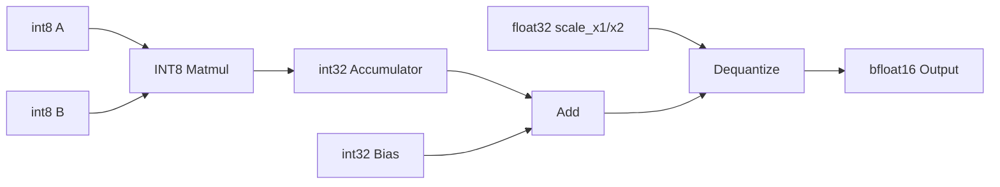
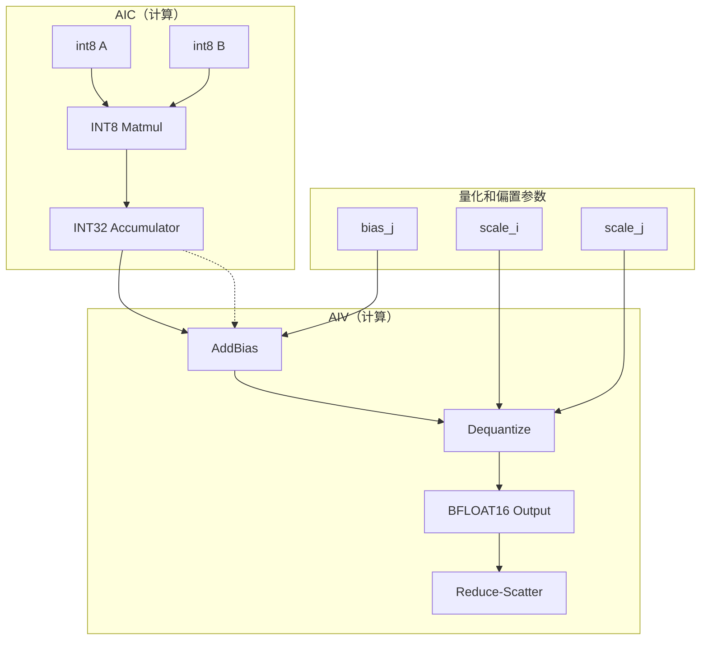
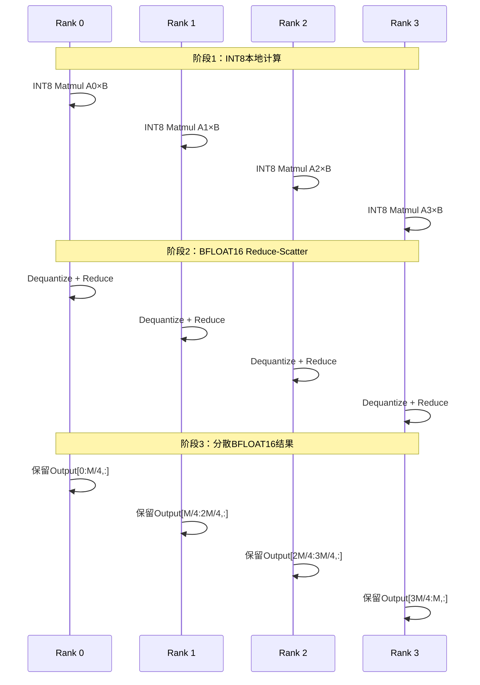

 # 量化矩阵乘法Reduce-Scatter算子设计文档

## 1. 算子概述

### 1.1 功能描述
量化矩阵乘法Reduce-Scatter算子（QuantizedMatmulReduceScatter）是一个支持INT8量化的分布式矩阵乘法算子，结合reduce-scatter通信模式，用于高效的大规模分布式深度学习训练。

### 1.2 算子签名
```cpp
void QuantizedMatmulReduceScatter(
    uint64_t fftsAddr,
    GM_ADDR x1,           // 输入矩阵A: [M, K], int8
    GM_ADDR x2,           // 输入矩阵B: [K, N], int8  
    GM_ADDR scale_x1,     // pertoken 量化缩放因子: [M], float32
    GM_ADDR scale_x2,     // perchannel 量化缩放因子: [N], float32
    GM_ADDR bias,         // 偏置: [N], int32
    GM_ADDR output,       // 输出矩阵: [M/rankSize, N], bfloat16
    GM_ADDR symmetricPtr, // 共享内存指针
    uint32_t m, 
    uint32_t n, 
    uint32_t k
);
```

### 1.3 输入输出规格
| 参数 | 形状 | 数据类型 | 描述 |
|------|------|----------|------|
| x1 | [M, K] | int8 | 量化后的输入矩阵A |
| x2 | [K, N] | int8 | 量化后的输入矩阵B |
| scale_x1 | [M] | float32 | x1量化缩放因子 |
| scale_x2 | [N] | float32 | x2量化缩放因子 |
| bias | [N] | int32 | 偏置项 |
| output | [M/rankSize, N] | bfloat16 | 输出矩阵（每个rank保留部分） |

## 2. 量化算法设计

### 2.1 量化计算流程


### 2.2 量化公式
```
// 量化
x1_int8 = round(x1_fp32 / scale_x1)
x2_int8 = round(x2_fp32 / scale_x2)

// 矩阵乘法（INT8×INT8→INT32）
accumulator_int32 = x1_int8 × x2_int8

// 反量化和偏置加法
// for int32 bias
dequantized_fp32 = accumulator_int32 + bias[j]
result_fp32 = dequantized_fp32 * scale_x1[i] * scale_x2[j]
output_bfloat16 = cast_to_bfloat16(result_fp32)
```

## 3. 核心实现架构

### 3.1 量化BlockMmad设计
```cpp
// 量化矩阵乘法核心
using QuantizedBlockMmad = Catlass::Gemm::Block::BlockMmad<
    MmadDispatchPolicy,
    L1TileShape, L0TileShape,
    QuantizedAType, QuantizedBType, AccumulatorType
>;

// 数据类型定义
using QuantizedAType = Catlass::Gemm::GemmType<int8_t, LayoutA>;
using QuantizedBType = Catlass::Gemm::GemmType<int8_t, LayoutB>;
using AccumulatorType = Catlass::Gemm::GemmType<int32_t, LayoutC>;
using OutputType = Catlass::Gemm::GemmType<bfloat16, LayoutD>;
```

### 3.2 量化Epilogue设计
```cpp
// 量化后处理：INT32→BFLOAT16
using QuantizedEpilogue = Catlass::Epilogue::Block::BlockEpilogue<
    DequantizeDispatch,
    AccumulatorType, OutputType,
    DequantizeTileShape, TileDequantizeCopy, TileScheduler
>;
```

### 3.3 计算流程


## 4. 内存布局设计

### 4.1 量化数据布局
```cpp
// 量化输入布局
Catlass::layout::RowMajor layoutQuantizedA{m, k, k};
Catlass::layout::RowMajor layoutQuantizedB{k, n, n};

// 累加器布局（INT32）
Catlass::layout::RowMajor layoutAccumulator{m / rankSize, n, n};

// 输出布局（BFLOAT16）
Catlass::layout::RowMajor layoutOutput{m / rankSize, n, n};
```

### 4.2 共享内存布局
```cpp
// 量化共享内存布局
Catlass::layout::RowMajor layoutQuantizedPeerMemStore{
    L1TileShape::M * commInterval * BLOCK_NUM * workspaceStages,
    L1TileShape::N,
    L1TileShape::N
};
```

## 5. 量化优化策略

### 5.1 INT8计算优化
```cpp

// INT8分块策略
using Int8L1TileShape = Catlass::GemmShape<128, 256, 256>;
using Int8L0TileShape = Catlass::GemmShape<128, 256, 64>;
```

### 5.2 量化精度控制
```cpp
// 量化参数在计算中的使用
CATLASS_DEVICE
void DequantizeAndAddBias(...) {
    // 对每个输出元素进行反量化和偏置加法
    for (uint32_t i = 0; i < actualBlockShape.row(); ++i) {
        for (uint32_t j = 0; j < actualBlockShape.column(); ++j) {
            // 读取INT32累加器值
            int32_t accumulator_value = gmAccumulator[offset];
            
            // 读取对应的scale和bias
            float scale_x1 = gmScaleX1.GetValue(i);
            float scale_x2 = gmScale.GetValue(j);
            int32_t bias_value = gmBias.GetValue(j);
            
            // 反量化：INT32 → FP32
            float result_fp32 = static_cast<float>(accumulator_value + bias_value) * scale_x1 *scale_x2;
            
            // 转换为BFLOAT16
            ElementOutput result_bfloat16 = static_cast<ElementOutput>(result_fp32);
            
            // 写入输出
            gmOutput[offsetOutput] = result_bfloat16;
        }
    }
}
```

### 5.3 内存带宽优化
- INT8数据减少内存带宽需求（相比FP16减少50%）
- 使用INT32累加器避免溢出
- 批量反量化减少访存次数

## 6. 通信模式适配

### 6.1 量化Reduce-Scatter


### 6.2 量化通信优化(扩展功能)
```cpp
// 量化通信参数
struct QuantizedCommParams {
    uint32_t int8_comm_interval;    // INT8通信间隔
    uint32_t bfloat16_comm_interval; // BFLOAT16通信间隔
    bool enable_int8_compression;   // 启用INT8压缩
};
```

## 7. 性能优化策略

### 7.1 量化计算优化
- **INT8 Tensor Core**：利用昇腾INT8硬件加速
- **量化感知训练**：支持量化感知的权重更新
- **动态量化**：运行时动态调整量化参数

### 7.2 内存优化
- **INT8存储**：减少内存占用50%
- **量化缓存**：缓存量化参数避免重复计算
- **批量反量化**：减少访存次数

### 7.3 通信优化
- **量化通信**：INT8数据通信减少带宽需求
- **压缩传输**：支持INT8数据压缩传输
- **流水线通信**：计算和通信重叠执行

## 8. 使用示例
image.png
基本使用
```cpp
// 量化矩阵乘法Reduce-Scatter
QuantizedMatmulReduceScatter<<<BLOCK_NUM, nullptr, stream>>>(
    fftsAddr,
    x1Device,      // [32, 16384], int8
    x2Device,      // [16384, 7168], int8
    scaleDeviceX1,   // [32], float32 - 每行一个缩放因子
    scaleDeviceX2,   // [7168], float32 - 每列一个缩放因子
    biasDevice,    // [7168], int32 - 每列一个偏置
    outputDevice,  // [8, 7168], bfloat16 (rank=4时)
    symmetricPtr,
    32, 7168, 16384,
    quantParams    // 量化参数
);
```


## 9. 测试验证

### 9.1 精度验证
```cpp
// 量化精度测试
void TestQuantizedAccuracy() {
    // 生成FP32参考数据
    GenerateFP32ReferenceData();
    
    // 执行量化计算
    RunQuantizedMatmulReduceScatter();
    
    // 比较精度
    CompareWithReference(1e-3); // 允许1e-3误差
}
```

### 9.2 性能测试
```cpp
// 性能基准测试
void BenchmarkQuantizedPerformance() {
    // 测试不同矩阵大小
    TestShapes shapes[] = {
        {32, 16384, 7168},
        {64, 32768, 14336},
        {128, 65536, 28672}
    };
    
    for (auto& shape : shapes) {
        MeasureThroughput(shape);
        MeasureMemoryUsage(shape);
    }
}
```

## 10. 总结

量化矩阵乘法Reduce-Scatter算子具有以下优势：

1. **高效计算**：INT8×INT8计算相比FP16提升2倍性能
2. **内存优化**：INT8存储减少50%内存占用
3. **通信优化**：量化数据传输减少带宽需求
4. **精度保证**：INT32累加器+BFLOAT16输出保证精度
5. **分布式友好**：保持原有reduce-scatter通信模式

该算子特别适合大规模分布式深度学习训练，能够显著提升训练效率和降低硬件成本。

## 11. 昇腾INT8优化技术

### 11.1 INT8 Tensor Core
根据[昇腾CANN算子开发文档](https://www.hiascend.com/document/detail/zh/CANNCommunityEdition/82RC1/opdevg/Ascendcopdevg/atlas_ascendc_10_10017.html)，昇腾Atlas A2支持INT8 Tensor Core加速：

### 11.2 量化精度控制
- **INT8输入**：使用对称量化，范围[-128, 127]
- **INT32累加器**：避免INT8×INT8溢出
- **BFLOAT16输出**：保持足够的数值精度

### 11.3 内存带宽优化
- **INT8存储**：相比FP16减少50%内存占用
- **量化缓存**：缓存量化参数避免重复计算
- **批量反量化**：减少访存次数

## 12. 参考文档

- [昇腾CANN算子开发文档](https://www.hiascend.com/document/detail/zh/CANNCommunityEdition/82RC1/opdevg/Ascendcopdevg/atlas_ascendc_10_10017.html)
- 昇腾Atlas A2架构INT8 Tensor Core规范
- CUTLASS量化矩阵乘法实现参考