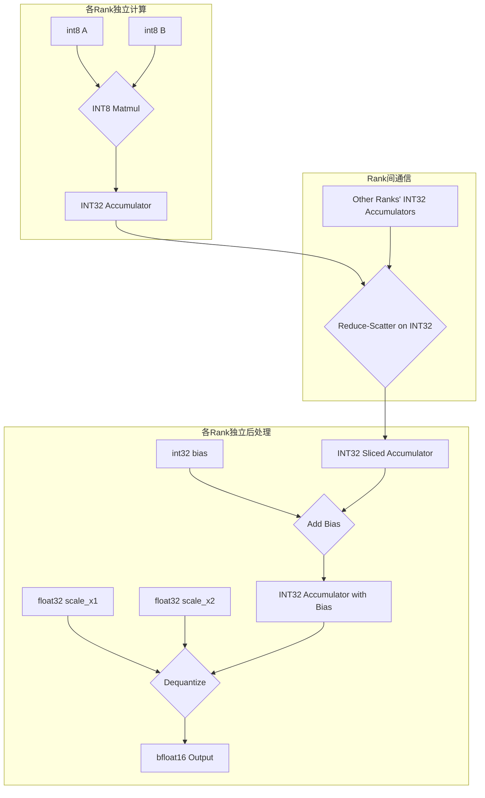
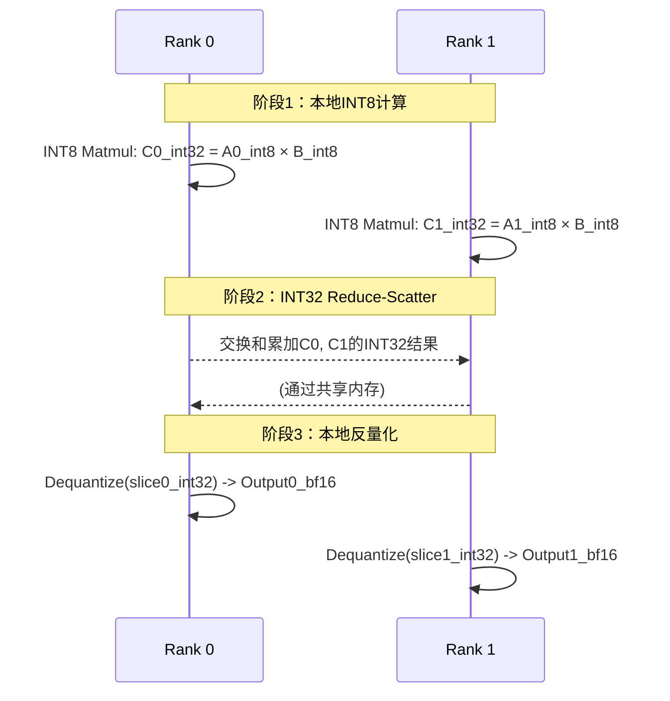

 # 量化矩阵乘法Reduce-Scatter算子设计文档

## 1. 算子概述

### 1.1 功能描述
量化矩阵乘法Reduce-Scatter算子（QuantizedMatmulReduceScatter）是一个支持INT8量化的分布式矩阵乘法算子，结合reduce-scatter通信模式，用于高效的大规模分布式深度学习训练。

它首先在每个计算单元（Rank）上独立执行INT8矩阵乘法，得到INT32累加结果。随后，通过Reduce-Scatter操作对所有Rank的INT32累加结果进行求和，并将结果分片回传给各个Rank。最后，每个Rank对接收到的INT32分片执行反量化，得到最终的BFLOAT16输出。

### 1.2 算子签名
```cpp
void QuantizedMatmulReduceScatter(
    uint64_t fftsAddr,
    GM_ADDR x1,           // 输入矩阵A: [M, K], int8
    GM_ADDR x2,           // 输入矩阵B: [K, N], int8  
    GM_ADDR scale_x1,     // per-token 量化缩放因子: [M], float32
    GM_ADDR scale_x2,     // per-channel 量化缩放因子: [N], float32
    GM_ADDR bias,         // (可选) 偏置: [N], int32
    GM_ADDR output,       // 输出矩阵: [M/rankSize, N], bfloat16
    GM_ADDR symmetricPtr, // 用于Rank间通信的共享内存工作空间 (workspace)
    uint32_t m, 
    uint32_t n, 
    uint32_t k
);
```

### 1.3 输入输出规格
| 参数 | 形状 | 数据类型 | 描述 |
|------|------|----------|------|
| x1 | [M, K] | int8 | 量化后的输入矩阵A |
| x2 | [K, N] | int8 | 量化后的输入矩阵B |
| scale_x1 | [M] | float32 | x1的per-token量化缩放因子 |
| scale_x2 | [N] | float32 | x2的per-channel量化缩放因子 |
| bias | [N] | int32 | (可选) 偏置项。如果传入空指针，则跳过此步骤。 |
| output | [M/rankSize, N] | bfloat16 | 输出矩阵（每个rank保留部分） |
| symmetricPtr | - | GM_ADDR | 用于Reduce-Scatter通信的共享内存工作区 |

## 2. 量化算法设计

### 2.1 核心计算流程


### 2.2 量化与反量化公式
```
// 伪代码: 量化
x1_int8 = round(x1_fp32 / scale_x1)
x2_int8 = round(x2_fp32 / scale_x2)

// 伪代码: INT8矩阵乘法
accumulator_int32 = x1_int8 × x2_int8

// 伪代码: 反量化和偏置加法
// 注意：在分布式计算中，每个rank只处理A矩阵的一部分，
// 因此需要根据rankId正确偏移scale_x1指针。
// rank_offset = rankId * (M / rankSize)
// i_local = i_global - rank_offset
// if bias is nullptr, bias_val = 0
accumulator_with_bias_int32 = accumulator_int32[i_local][j] + bias_val[j]
result_fp32 = accumulator_with_bias_int32 * scale_x1[i_global] * scale_x2[j]
output_bfloat16 = cast_to_bfloat16(result_fp32)
```

## 3. 核心实现架构

### 3.1 计算与通信分离
算子采用计算（AIC）和通信/后处理（AIV）分离的设计。
- **AIC (AI Core)**: 负责执行高密度的 `INT8 × INT8 → INT32` 矩阵乘法计算。
- **AIV (AI Vector Core)**: 负责执行 `Reduce-Scatter` 通信，以及后续的偏置加法、反量化等处理。

### 3.2 主要模块
- **BlockMmad**: `catlass`库提供的矩阵乘法模块，用于执行分块的INT8矩阵乘法。
- **CommBlockEpilogue**: `catcoc`库提供的通信Epilogue，用于执行 `Reduce-Scatter` 操作。它将本地计算出的 `INT32` 累加结果与其他Rank进行交换和累加。
- **BlockEpilogueDequant**: `catlass`库提供的后处理Epilogue，用于在 `Reduce-Scatter` 完成后，对每个Rank持有的 `INT32` 结果分片进行反量化，并转换为 `BFLOAT16`。

## 4. 内存布局设计

### 4.1 全局内存 (Global Memory)
- **输入布局**: `x1`, `x2`, `scale_x1`, `scale_x2`, `bias` 均存储在GM中。
- **中间结果布局**: 每个Rank计算出的 `INT32` 累加器结果存储在各自的GM空间中，形状为 `[M/rankSize, N]`。
- **输出布局**: 最终的 `BFLOAT16` 输出也存储在GM中，形状为 `[M/rankSize, N]`。

### 4.2 共享内存 (Symmetric Memory)
- **用途**: `symmetricPtr` 指向的共享内存区域被用作 `Reduce-Scatter` 操作的**临时工作空间（Workspace）**。
- **工作方式**: 在 `Reduce-Scatter` 过程中，一个Rank需要读取其他Rank计算出的 `INT32` 累加结果。为了高效实现这一过程，其他Rank会先将自己的结果写入到这个所有Rank都能访问的共享内存区域，然后目标Rank再从这里读取数据进行累加。
- **布局**:
  ```cpp
  Catlass::layout::RowMajor layoutPeerMemStore{
      L1TileShape::M * commInterval * BLOCK_NUM * workspaceStages,
      L1TileShape::N,
      L1TileShape::N
  };
  ```

## 5. 量化精度控制与分布式修正

### 5.1 INT32累加
使用 `INT32` 作为累加器数据类型，可以有效避免 `INT8 × INT8` 计算过程中可能出现的溢出问题，保证了计算中间结果的精度。

### 5.2 分布式环境下的量化参数修正
在分布式（多Rank）场景下，输入矩阵 `x1` (A) 被沿 `M` 维度切分。因此，与之对应的 `per-token` 缩放因子 `scale_x1` 也必须被正确地索引。

**关键修正点**：在为反量化Epilogue准备参数时，必须根据当前 `rankId` 计算 `scale_x1` 指针的偏移量。

```cpp
// 获取当前rankId和总rank数
uint32_t rank = shmem_my_pe();
uint32_t rankSize = shmem_n_pes();

// 计算每个rank负责的行数和偏移量
uint32_t m_per_rank = m / rankSize;
uint32_t scale_x1_offset = rank * m_per_rank;

// 准备反量化参数，注意scale_x1指针的偏移和长度的变化
typename BlockEpilogueDequant::Params dequantParams{
    reinterpret_cast<__gm__ float *>(scale_x2), Catlass::layout::VectorLayout(n),
    // 关键修正：传入偏移后的指针和切片后的大小
    reinterpret_cast<__gm__ float *>(scale_x1) + scale_x1_offset, Catlass::layout::VectorLayout(m_per_rank),
    reinterpret_cast<__gm__ half *>(d_out), layoutD_out
};
```
这个修正是保证多Rank环境下精度一致性的核心。

## 6. 通信模式适配

### 6.1 两阶段计算与通信
算子的核心流程分为两个主要阶段：

1.  **阶段一：本地INT8矩阵乘法**
    - 每个Rank独立地计算其负责的 `A` 矩阵分片 (`A_i`) 与完整的 `B` 矩阵的乘积，得到 `INT32` 的中间结果 `C_i`。

2.  **阶段二：INT32 Reduce-Scatter + 本地反量化**
    - **通信**：所有Rank通过共享内存，对 `INT32` 中间结果 `C_i` 执行 `Reduce-Scatter` 操作。操作完成后，每个Rank会得到最终结果矩阵的一个分片（`Output_slice_i`），但此时数据类型仍为 `INT32`。
    - **后处理**：每个Rank独立地对其持有的 `INT32` 分片执行偏置加法和反量化操作，最终得到 `BFLOAT16` 格式的输出。

### 6.2 流程图


## 7. 总结

该量化算子通过将高成本的通信操作（Reduce-Scatter）在 `INT32` 数据上完成，避免了在 `BFLOAT16` 或 `FP32` 上进行通信，从而优化了性能。同时，通过精确处理分布式计算中的量化参数，确保了在多Rank环境下的计算精度。共享内存（Symmetric Memory）在此过程中扮演了关键的临时数据交换区的角色。